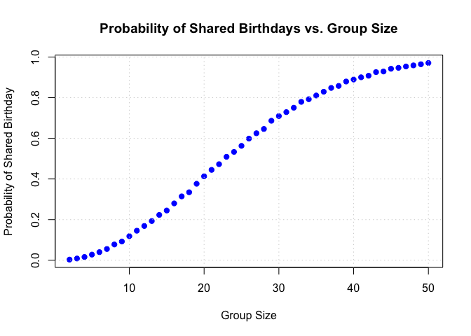

P8105_hw5_zz3166
================
Zihan Zhao
2024-11-15

``` r
library(broom)
library(ggplot2)
library(dplyr)
```

    ## 
    ## Attaching package: 'dplyr'

    ## The following objects are masked from 'package:stats':
    ## 
    ##     filter, lag

    ## The following objects are masked from 'package:base':
    ## 
    ##     intersect, setdiff, setequal, union

``` r
library(tidyverse)  
```

    ## ── Attaching core tidyverse packages ──────────────────────── tidyverse 2.0.0 ──
    ## ✔ forcats   1.0.0     ✔ stringr   1.5.1
    ## ✔ lubridate 1.9.3     ✔ tibble    3.2.1
    ## ✔ purrr     1.0.2     ✔ tidyr     1.3.1
    ## ✔ readr     2.1.5

    ## ── Conflicts ────────────────────────────────────────── tidyverse_conflicts() ──
    ## ✖ dplyr::filter() masks stats::filter()
    ## ✖ dplyr::lag()    masks stats::lag()
    ## ℹ Use the conflicted package (<http://conflicted.r-lib.org/>) to force all conflicts to become errors

``` r
library(broom)      
library(purrr)      
```

# problem 1

## Introduction

Suppose you put *n* people in a room and want to know the probability
that at least two people share a birthday. For simplicity, we’ll assume
there are no leap years (i.e., there are only 365 days) and that
birthdays are uniformly distributed over the year.

In this analysis, we will:

- Write a function that simulates drawing birthdays for a group of *n*
  people and checks for shared birthdays.
- Run this simulation 10,000 times for each group size between 2 and 50.
- Compute and plot the probability that at least two people share a
  birthday as a function of group size.

## Simulation Function

First, we define a function to simulate one trial of the birthday
problem for a group of size *n*.

``` r
# Function to simulate one trial
birthday_simulation <- function(n) {
  # Randomly draw birthdays for n people (numbers from 1 to 365)
  birthdays <- sample(1:365, n, replace = TRUE)
  # Check if there are any duplicate birthdays
  any(duplicated(birthdays))
}
```

## Running the Simulations

We run the simulation 10,000 times for each group size from 2 to 50.

``` r
# Set the range of group sizes
group_sizes <- 2:50
# Number of simulations to run for each group size
num_simulations <- 10000
# Initialize a vector to store probabilities for each group size
probabilities <- numeric(length(group_sizes))

# Loop over each group size
for (i in seq_along(group_sizes)) {
  n <- group_sizes[i]
  # Run the simulation num_simulations times and store the results
  results <- replicate(num_simulations, birthday_simulation(n))
  # Calculate the probability of at least two people sharing a birthday
  probabilities[i] <- mean(results)
}
```

## Results

We plot the probability of at least two people sharing a birthday as a
function of group size.

``` r
# Plot the probability as a function of group size
plot(group_sizes, probabilities, type = 'b', pch = 19, col = 'blue',
     xlab = 'Group Size',
     ylab = 'Probability of Shared Birthday',
     main = 'Probability of Shared Birthdays vs. Group Size')
grid()
```

<!-- -->
Comment on the results:The probability of at least two people sharing a
birthday grows rapidly as the group size increases. Around a group size
of 23, the probability exceeds 50%, which is a well-known result in
probability theory. This phenomenon is called the Birthday Paradox:
despite there being 365 possible birthdays, a surprisingly small group
size is needed to have a better-than-even chance of a shared birthday.
As the group size continues to increase,the probability approaches 1,
meaning it becomes almost certain that at least two people share a
birthday in larger groups.

# Problem 2

# Introduction

When designing an experiment or analysis, a common question is whether
it is likely that a true effect will be detected—in other words, whether
a false null hypothesis will be rejected. The probability that a false
null hypothesis is rejected is referred to as **power**, and it depends
on several factors, including the sample size, the effect size, and the
error variance. In this analysis, we will conduct a simulation to
explore power in a one-sample t-test.

# Simulation Setup

We will conduct simulations with the following parameters:

- Sample size ($n$): 30
- Standard deviation ($\sigma$): 5
- True mean ($\mu$): Varies from 0 to 6
- Number of simulations per $\mu$ value: 5000
- Significance level ($\alpha$): 0.05

We will generate datasets from the model:

$$
x \sim \text{Normal}(\mu, \sigma)
$$

For each dataset, we will:

- Estimate the sample mean ($\hat{\mu}$)
- Perform a one-sample t-test of $H_0: \mu = 0$
- Record the p-value from the test

We will then analyze how the power of the test and the estimates of
$\hat{\mu}$ vary with the true value of $\mu$.

### Parameters

``` r
# Simulation parameters
n <- 30
sigma <- 5
mu_values <- 0:6
num_simulations <- 5000
alpha <- 0.05
```

## Simulation

We will perform the simulations across the specified values of $\mu$.

``` r
# Initialize an empty list to store results
simulation_results <- list()

# Loop over each true mean value
for (mu in mu_values) {
  # Initialize vectors to store estimates and p-values
  mu_hats <- numeric(num_simulations)
  p_values <- numeric(num_simulations)
  
  # Perform simulations
  for (i in 1:num_simulations) {
    # Generate a dataset
    x <- rnorm(n, mean = mu, sd = sigma)
    
    # Perform one-sample t-test against mu = 0
    t_test_result <- t.test(x, mu = 0)
    
    # Extract estimate and p-value using broom::tidy
    tidy_result <- tidy(t_test_result)
    mu_hats[i] <- tidy_result$estimate
    p_values[i] <- tidy_result$p.value
  }
  
  # Store results in the list
  simulation_results[[as.character(mu)]] <- data.frame(
    mu_hat = mu_hats,
    p_value = p_values,
    mu_true = mu
  )
}
```

## Results

### Power Analysis

We calculate the power for each μ value by computing the proportion of
simulations where the null hypothesis was rejected.

``` r
# Combine all results into one data frame
all_results <- bind_rows(simulation_results)

# Calculate power for each mu value
power_results <- all_results %>%
  group_by(mu_true) %>%
  summarise(
    power = mean(p_value < alpha)
  )
```

### Plot: Power vs. True Mean ($\mu$)

``` r
# Plot the power as a function of mu
ggplot(power_results, aes(x = mu_true, y = power)) +
  geom_line(color = 'blue') +
  geom_point(color = 'red') +
  labs(
    title = "Power vs. True Mean (\u03BC)",
    x = "True Mean (\u03BC)",
    y = "Power"
  ) +
  theme_minimal()
```

<!-- -->

### Power vs. True Mean ($\mu$)

In the first plot, which shows “Power vs. True Mean ($\mu$),” we can see
that the power of the test increases as the true value of $\mu$
increases. Specifically:

- For $\mu = 0$, the power is approximately 0, as expected, since
  there’s no effect.
- As $\mu$ increases, the power increases, indicating a higher
  probability of correctly rejecting the null hypothesis when a true
  effect exists.
- At larger values of $\mu$, such as $\mu = 4$ or higher, the power
  approaches 1, meaning the test is almost certain to reject the false
  null hypothesis.

**Association Between Effect Size and Power:** The power of a
statistical test is positively associated with the effect size ($\mu$).
As the effect size increases, it becomes easier to detect the effect,
leading to a higher power. This is evident from the plot, where the
probability of rejecting the null hypothesis increases with larger
values of $\mu$. When the true effect size is small, the power is lower
because the test has more difficulty distinguishing between noise and an
actual effect.

## Estimation of $\hat{\mu}$

### Average Estimate of $\hat{\mu}$ vs. True Mean ($\mu$)

``` r
# Calculate average estimate of mu_hat for each mu_true
mu_hat_results <- all_results %>%
  group_by(mu_true) %>%
  summarise(
    mean_mu_hat = mean(mu_hat)
  )

# Plot the average mu_hat vs. mu_true
ggplot(mu_hat_results, aes(x = mu_true, y = mean_mu_hat)) +
  geom_line(color = 'green') +
  geom_point(color = 'darkgreen') +
  labs(
    title = "Average Estimate of \u03BĈ vs. True Mean (\u03BC)",
    x = "True Mean (\u03BC)",
    y = "Average Estimate of \u03BĈ"
  ) +
  theme_minimal()
```

<!-- -->

The second plot shows the “Average Estimate of $\hat{\mu}$ vs. True Mean
($\mu$).”

- As $\mu$ increases, the average estimate of $\hat{\mu}$ increases
  linearly and is approximately equal to the true mean.
- This demonstrates that the sample mean ($\hat{\mu}$) is an unbiased
  estimator of the true mean ($\mu$).

### Average Estimate of $\hat{\mu}$ for Rejected Null Hypotheses

``` r
# Calculate average mu_hat only for simulations where null was rejected
mu_hat_rejected_results <- all_results %>%
  filter(p_value < alpha) %>%
  group_by(mu_true) %>%
  summarise(
    mean_mu_hat_rejected = mean(mu_hat)
  )

# Merge the two datasets
mu_hat_combined <- mu_hat_results %>%
  left_join(mu_hat_rejected_results, by = "mu_true")

# Plot both averages
ggplot(mu_hat_combined, aes(x = mu_true)) +
  geom_line(aes(y = mean_mu_hat, color = 'All Samples')) +
  geom_point(aes(y = mean_mu_hat, color = 'All Samples')) +
  geom_line(aes(y = mean_mu_hat_rejected, color = 'Rejected Null')) +
  geom_point(aes(y = mean_mu_hat_rejected, color = 'Rejected Null')) +
  labs(
    title = "Average Estimate of \u03BĈ vs. True Mean (\u03BC)",
    x = "True Mean (\u03BC)",
    y = "Average Estimate of \u03BĈ",
    color = "Samples"
  ) +
  theme_minimal()
```

<!-- -->

The third plot shows the “Average Estimate of $\hat{\mu}$ vs. True Mean
($\mu$)” for both all samples and the subset of samples where the null
hypothesis was rejected.

- The blue line represents the average estimate of $\hat{\mu}$ for
  rejected null hypotheses, while the red line represents the average
  for all samples.
- For the rejected null hypotheses, the average estimate of $\hat{\mu}$
  is generally higher compared to all samples, particularly for smaller
  values of $\mu$.

**Is the Sample Average of $\hat{\mu}$ Across Tests Where the Null Is
Rejected Approximately Equal to the True Value of $\mu$?**

- **No,** the sample average of $\hat{\mu}$ across tests where the null
  is rejected is not always approximately equal to the true value of
  $\mu$. This is because there is a selection bias in considering only
  the samples where the null hypothesis was rejected. The estimates of
  $\hat{\mu}$ in this subset are typically skewed upwards because we are
  more likely to reject the null hypothesis in cases where the sample
  mean is farther from 0 (the hypothesized null value). This phenomenon
  is often referred to as “regression toward the mean” or selection bias
  in hypothesis testing.

## Summary

- **Power vs. True Mean:** The power of the test increases with the
  effect size, $\mu$. When the true mean is larger, it is easier to
  reject the null hypothesis, leading to higher power.
- **Average Estimate of $\hat{\mu}$:** The average estimate of
  $\hat{\mu}$ is generally unbiased and closely matches the true mean
  $\mu$ across all samples.
- **Rejected Null Hypotheses:** When considering only rejected null
  hypotheses, the average estimate of $\hat{\mu}$ is higher than for all
  samples, due to selection bias. This bias occurs because we are more
  likely to reject the null when $\hat{\mu}$ is farther from the
  hypothesized value.

These conclusions provide insights into the behavior of hypothesis
testing, demonstrating how power is influenced by effect size and how
selection bias can impact our interpretation of estimates when only
considering significant results.

# Problem 3

## Introduction

The **Washington Post** has gathered data on homicides in 50 large U.S.
cities and made the data available through a [GitHub
repository](https://github.com/washingtonpost/data-homicides). The
accompanying article provides context and insights into the data
collected.

In this analysis, we will:

- Describe the raw homicide data.
- Create a `city_state` variable (e.g., `"Baltimore, MD"`).
- Summarize within cities to obtain:
  - The total number of homicides.
  - The number of unsolved homicides.
- For Baltimore, MD:
  - Estimate the proportion of unsolved homicides using `prop.test()`.
  - Extract the estimated proportion and confidence intervals.
- Run `prop.test()` for each city and extract proportions and confidence
  intervals.
- Create a plot showing the estimates and confidence intervals for each
  city, organized by the proportion of unsolved homicides.

## Data Loading

We read the homicide data directly from the Washington Post’s GitHub
repository.

``` r
# Read the data from the GitHub repository
homicide_data <- read_csv("https://raw.githubusercontent.com/washingtonpost/data-homicides/master/homicide-data.csv")
```

    ## Rows: 52179 Columns: 12
    ## ── Column specification ────────────────────────────────────────────────────────
    ## Delimiter: ","
    ## chr (9): uid, victim_last, victim_first, victim_race, victim_age, victim_sex...
    ## dbl (3): reported_date, lat, lon
    ## 
    ## ℹ Use `spec()` to retrieve the full column specification for this data.
    ## ℹ Specify the column types or set `show_col_types = FALSE` to quiet this message.

## Data Description

Let’s explore the structure and contents of the dataset.

``` r
# Display the first few rows of the data
head(homicide_data)
```

    ## # A tibble: 6 × 12
    ##   uid   reported_date victim_last victim_first victim_race victim_age victim_sex
    ##   <chr>         <dbl> <chr>       <chr>        <chr>       <chr>      <chr>     
    ## 1 Alb-…      20100504 GARCIA      JUAN         Hispanic    78         Male      
    ## 2 Alb-…      20100216 MONTOYA     CAMERON      Hispanic    17         Male      
    ## 3 Alb-…      20100601 SATTERFIELD VIVIANA      White       15         Female    
    ## 4 Alb-…      20100101 MENDIOLA    CARLOS       Hispanic    32         Male      
    ## 5 Alb-…      20100102 MULA        VIVIAN       White       72         Female    
    ## 6 Alb-…      20100126 BOOK        GERALDINE    White       91         Female    
    ## # ℹ 5 more variables: city <chr>, state <chr>, lat <dbl>, lon <dbl>,
    ## #   disposition <chr>

``` r
# Get a glimpse of the data structure
glimpse(homicide_data)
```

    ## Rows: 52,179
    ## Columns: 12
    ## $ uid           <chr> "Alb-000001", "Alb-000002", "Alb-000003", "Alb-000004", …
    ## $ reported_date <dbl> 20100504, 20100216, 20100601, 20100101, 20100102, 201001…
    ## $ victim_last   <chr> "GARCIA", "MONTOYA", "SATTERFIELD", "MENDIOLA", "MULA", …
    ## $ victim_first  <chr> "JUAN", "CAMERON", "VIVIANA", "CARLOS", "VIVIAN", "GERAL…
    ## $ victim_race   <chr> "Hispanic", "Hispanic", "White", "Hispanic", "White", "W…
    ## $ victim_age    <chr> "78", "17", "15", "32", "72", "91", "52", "52", "56", "4…
    ## $ victim_sex    <chr> "Male", "Male", "Female", "Male", "Female", "Female", "M…
    ## $ city          <chr> "Albuquerque", "Albuquerque", "Albuquerque", "Albuquerqu…
    ## $ state         <chr> "NM", "NM", "NM", "NM", "NM", "NM", "NM", "NM", "NM", "N…
    ## $ lat           <dbl> 35.09579, 35.05681, 35.08609, 35.07849, 35.13036, 35.151…
    ## $ lon           <dbl> -106.5386, -106.7153, -106.6956, -106.5561, -106.5810, -…
    ## $ disposition   <chr> "Closed without arrest", "Closed by arrest", "Closed wit…

Description of Key Variables:

- `uid`: Unique identifier for each homicide case.
- `reported_date`: Date the homicide was reported.
- `victim_last`, `victim_first`, `victim_race`, `victim_age`,
  `victim_sex`: Information about the victim.
- `city`: City where the homicide occurred.
- `state`: State where the homicide occurred.
- `disposition`: Status of the case (e.g., “Closed by arrest”, “Open/No
  arrest”, “Closed without arrest”).

## Data Preparation

### Creating `city_state` Variable

We create a new variable `city_state` by combining the `city` and
`state` columns.

``` r
# Create a city_state variable
homicide_data <- homicide_data %>%
  mutate(city_state = paste0(city, ", ", state))
```

### Identifying Unsolved Homicides

We define unsolved homicides as those with dispositions “Closed without
arrest” or “Open/No arrest”.

``` r
# Define unsolved homicides
unsolved_dispositions <- c("Closed without arrest", "Open/No arrest")

# Add a logical column indicating whether a homicide is unsolved
homicide_data <- homicide_data %>%
  mutate(unsolved = disposition %in% unsolved_dispositions)
```

### Summarizing Data Within Cities

We summarize the total number of homicides and the number of unsolved
homicides for each city.

``` r
# Summarize total homicides and unsolved homicides within each city
city_summary <- homicide_data %>%
  group_by(city_state) %>%
  summarise(
    total_homicides = n(),
    unsolved_homicides = sum(unsolved)
  ) %>%
  ungroup()

# Display the summary data
head(city_summary)
```

    ## # A tibble: 6 × 3
    ##   city_state      total_homicides unsolved_homicides
    ##   <chr>                     <int>              <int>
    ## 1 Albuquerque, NM             378                146
    ## 2 Atlanta, GA                 973                373
    ## 3 Baltimore, MD              2827               1825
    ## 4 Baton Rouge, LA             424                196
    ## 5 Birmingham, AL              800                347
    ## 6 Boston, MA                  614                310

## Analysis for Baltimore, MD

We focus on the city of Baltimore, MD, to estimate the proportion of
unsolved homicides.

### Extracting Baltimore Data

``` r
# Filter the summary data for Baltimore, MD
baltimore_data <- city_summary %>%
  filter(city_state == "Baltimore, MD")

# Extract the number of unsolved homicides and total homicides
baltimore_total <- baltimore_data$total_homicides
baltimore_unsolved <- baltimore_data$unsolved_homicides
```

### Estimating Proportion of Unsolved Homicides

We use the `prop.test()` function to estimate the proportion.

``` r
# Perform the proportion test
baltimore_prop_test <- prop.test(
  x = baltimore_unsolved,
  n = baltimore_total
)

# Tidy the prop.test output
baltimore_tidy <- tidy(baltimore_prop_test)

# Extract the estimated proportion and confidence intervals
baltimore_results <- baltimore_tidy %>%
  select(estimate, conf.low, conf.high) %>%
  mutate(city_state = "Baltimore, MD") %>%
  rename(
    proportion_unsolved = estimate,
    conf_low = conf.low,
    conf_high = conf.high
  )

# Display the results
baltimore_results
```

    ## # A tibble: 1 × 4
    ##   proportion_unsolved conf_low conf_high city_state   
    ##                 <dbl>    <dbl>     <dbl> <chr>        
    ## 1               0.646    0.628     0.663 Baltimore, MD

**Answer**: For **Baltimore, MD**, the estimated proportion of unsolved
homicides is approximately **0.6456**, with a confidence interval
ranging from **0.6276** to **0.6632**.

## Analysis for All Cities

We perform the same analysis for each city in the dataset.

### Performing Proportion Tests

``` r
# Apply prop.test to each city using map functions
city_prop_tests <- city_summary %>%
  mutate(
    prop_test = map2(
      unsolved_homicides,
      total_homicides,
      ~ prop.test(x = .x, n = .y)
    )
  )
```

    ## Warning: There was 1 warning in `mutate()`.
    ## ℹ In argument: `prop_test = map2(...)`.
    ## Caused by warning in `prop.test()`:
    ## ! Chi-squared approximation may be incorrect

### Tidying Test Outputs

``` r
# Tidy the outputs of prop.test
city_prop_tests <- city_prop_tests %>%
  mutate(
    tidy_test = map(prop_test, tidy)
  )
```

### Extracting Estimates and Confidence Intervals

``` r
# Unnest the tidy_test column to get a flat dataframe
city_results <- city_prop_tests %>%
  unnest(cols = c(tidy_test)) %>%
  select(
    city_state,
    total_homicides,
    unsolved_homicides,
    estimate,
    conf.low,
    conf.high
  ) %>%
  rename(
    proportion_unsolved = estimate,
    conf_low = conf.low,
    conf_high = conf.high
  ) %>%
  arrange(desc(proportion_unsolved))

# Display the first few rows
head(city_results)
```

    ## # A tibble: 6 × 6
    ##   city_state     total_homicides unsolved_homicides proportion_unsolved conf_low
    ##   <chr>                    <int>              <int>               <dbl>    <dbl>
    ## 1 Chicago, IL               5535               4073               0.736    0.724
    ## 2 New Orleans, …            1434                930               0.649    0.623
    ## 3 Baltimore, MD             2827               1825               0.646    0.628
    ## 4 San Bernardin…             275                170               0.618    0.558
    ## 5 Buffalo, NY                521                319               0.612    0.569
    ## 6 Miami, FL                  744                450               0.605    0.569
    ## # ℹ 1 more variable: conf_high <dbl>

**Answer**: The table shows the estimated proportion of unsolved
homicides for each city, along with the corresponding confidence
intervals. **Chicago, IL** has one of the highest proportions of
unsolved homicides at **0.7359**.

## Visualization

We create a plot showing the estimated proportion of unsolved homicides
and the confidence intervals for each city.

### Preparing Data for Plotting

We reorder the cities based on the proportion of unsolved homicides.

``` r
# Reorder the city_state factor based on the proportion_unsolved
city_results <- city_results %>%
  mutate(
    city_state = fct_reorder(city_state, proportion_unsolved)
  )
```

### Plotting the Estimates and Confidence Intervals

``` r
# Create the plot
ggplot(city_results, aes(x = proportion_unsolved, y = city_state)) +
  geom_point(color = 'steelblue') +
  geom_errorbarh(aes(xmin = conf_low, xmax = conf_high), height = 0.3, color = 'gray60') +
  labs(
    x = "Proportion of Unsolved Homicides",
    y = "City",
    title = "Proportion of Unsolved Homicides by City",
    caption = "Data Source: Washington Post Homicide Data"
  ) +
  theme_minimal(base_size = 12) +
  theme(
    axis.text.y = element_text(size = 8),
    plot.title = element_text(face = "bold", hjust = 0.5),
    plot.caption = element_text(hjust = 0)
  )
```

<!-- -->

**Answer**: The plot shows the estimated proportion of unsolved
homicides for each city, along with **confidence intervals**. Cities
like **Chicago, IL** and **New Orleans, LA** have higher proportions of
unsolved homicides, suggesting systemic challenges in solving homicide
cases in these areas.

### Key Insights and Interpretation

- **Variation Across Cities**: There is substantial variation in the
  proportion of unsolved homicides across different cities. For
  instance, **Chicago, IL** and **Baltimore, MD** have a high proportion
  of unsolved cases, suggesting potential issues in law enforcement or
  community cooperation.
- **Confidence Intervals**: Confidence intervals provide a range of
  uncertainty around the estimated proportions. Cities with wide
  intervals may have smaller sample sizes, resulting in less precise
  estimates.
- **Implications**: High proportions of unsolved homicides could
  indicate challenges related to resources, socio-economic factors, or
  other underlying issues. Policymakers and law enforcement agencies can
  use this information to allocate resources more effectively.

**Summary**: The analysis reveals that several large cities struggle
with high proportions of unsolved homicides. **Baltimore, MD** has
approximately **64.56%** unsolved homicides, and cities like **Chicago,
IL** and **New Orleans, LA** also have significant challenges. The
visualization highlights disparities across cities, emphasizing the need
for targeted interventions to improve homicide resolution rates.
